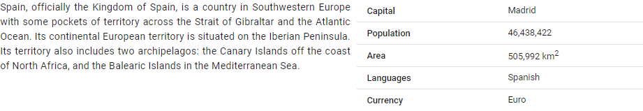
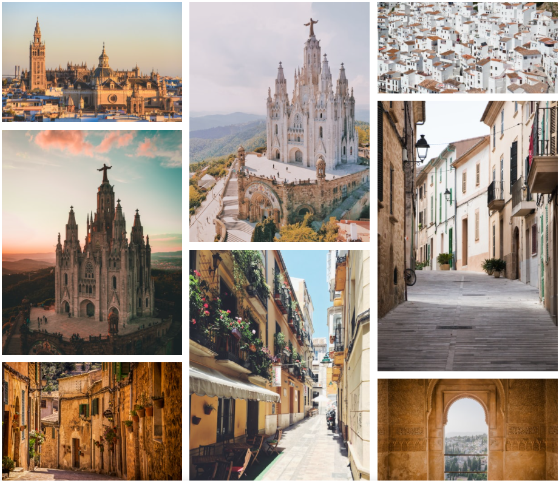
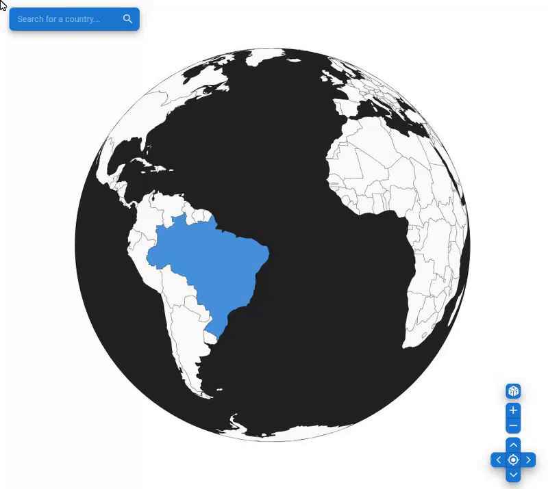

# Pocket Globe App

This app let's you explore all the counties of the world by clicking on them
on the draggable and zoomable globe.

## Country details through REST API

To fetch information about each country I'm using the following REST API endpoints:

- [REST Countries API](https://restcountries.eu/) - to get information such as country's capital, currency, etc.
- [Wikimedia REST API ](https://wikimedia.org/api/rest_v1/) - to get a short paragraph about a country

## Amazing photos from Unsplash JSON API

All the photos used in the app come from [Unsplash JSON API](https://unsplash.com/developers) which provides free and high-resolution photos.

## Go to your current location

## Show random country

## Autocomplete form

Use autocomplete form to find a country

## Dark mode

## Technologies used

- React
- D3 + TopoJSON + World Atlas TopoJSON
- Material-UI
- REST Countries API
- Unsplash API
- Wikimedia REST API

## Accessibility

### Keyboard shortcuts

| Key      | Description                |
| -------- | :------------------------- |
| `ctrl ↑` | Rotate up                  |
| `ctrl ↓` | Rotate down                |
| `ctrl ←` | Rotate left                |
| `ctrl →` | Rotate right               |
| `+`      | Zoom in                    |
| `-`      | Zoom out                   |
| `l`      | Rotate to selected country |
| `r`      | Select random country      |
| `w`      | Show/hide widgets          |
| `ctrl /` | Show/hide shortcuts        |
